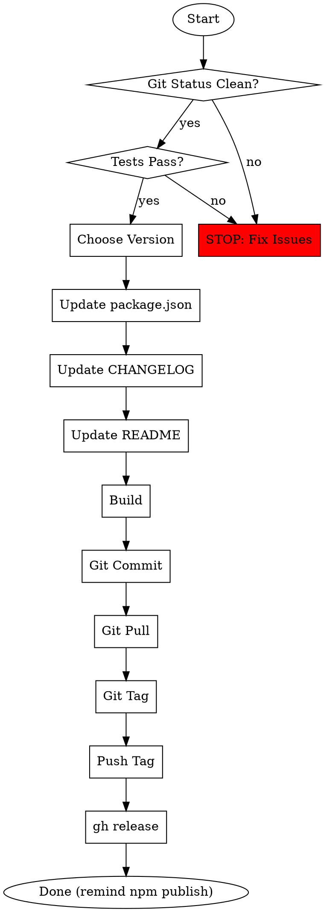

# Releasing

## Overview

版本发布助手，自动化 npm 包发布流程：版本号更新 → 文档同步 → Git Tag → GitHub Release → 提醒用户 npm 发布。

**核心原则：每个步骤必须验证成功，失败立即停止。**

## When to Use

- 准备发布新版本时
- 需要更新 CHANGELOG 时
- 需要 npm publish 时
- 需要 GitHub release 时

**NOT for:**
- Hot fix 紧急修复（需要特殊流程）
- 私有包发布
- 非 npm 项目

## Release Workflow



## Version Selection

| Type | Example | When to Use |
|------|---------|-------------|
| major | 1.0.0 → 2.0.0 | Breaking changes, incompatible API |
| minor | 1.0.0 → 1.1.0 | New features, backwards compatible |
| patch | 1.0.0 → 1.0.1 | Bug fixes, backwards compatible |

## Step Details

### 1. Pre-flight Checks

**MUST verify before starting:**

```bash
# 检查 git 状态
git status --porcelain
# 如果有输出，必须先处理

# 检查测试
npm test
# 必须全部通过
```

### 2. Version Bump

```bash
# 方式一：npm version 命令（自动 git commit + tag）
npm version patch|minor|major

# 方式二：手动更新 package.json（需要手动 commit）
# 编辑 package.json 中的 version 字段
```

### 3. Update CHANGELOG

添加新版本条目到 CHANGELOG.md 和 CHANGELOG_en.md：

```markdown
## [X.Y.Z] - YYYY-MM-DD

### Added
- 新增功能描述

### Changed
- 变更描述

### Fixed
- 修复描述
```

### 4. Update README

检查 README.md 和 README_en.md 中是否有版本相关内容需要更新：
- 安装命令中的版本号
- 更新日志链接
- 其他版本引用

### 5. Build & Commit

```bash
npm run build
git add .
git commit -m "chore: release v$VERSION"
```

### 6. Sync & Tag

```bash
# 先 pull 最新代码
git pull

# 创建 tag
git tag v$VERSION

# push commit 和 tag（使用实际分支名，如 master/main）
git push github <branch>
git push github v$VERSION
```

### 7. GitHub Release

```bash
gh release create v$VERSION --title v$VERSION --generate-notes
```

### 8. npm Publish (最后提醒用户)

**完成所有自动化步骤后，在最终消息中提醒用户手动执行 npm publish。**

**不要使用 ask_user_question 工具询问，直接在完成消息中提示即可。**

提示格式：
```
**发布完成！请手动执行 `npm publish` 完成 npm 发布。**
```

**用户执行前确认：**
- 已登录 npm (`npm whoami`)
- 有发布权限
- 网络连接正常

## Common Mistakes

| Mistake | Consequence | Prevention |
|---------|-------------|------------|
| 跳过 git status 检查 | 发布错误代码 | 必须检查，有输出就停止 |
| 跳过测试 | 发布有 bug 的版本 | 测试必须通过 |
| 忘记更新 CHANGELOG | 用户不知道变更内容 | 更新后必须验证格式 |
| 忘记 build | 发布旧代码 | build 后检查 dist 目录 |
| 忘记 git pull | tag 冲突或覆盖他人提交 | 创建 tag 前必须 pull |
| 先 npm publish 再 tag/gh release | 无法回退 | 严格遵守顺序：先 tag 和 gh release，最后提醒 npm publish |
| 版本号格式错误 | tag 创建失败 | 使用 semver 格式 |

## Red Flags - STOP and Fix

- 有未提交的更改
- 测试失败
- CHANGELOG 未更新
- 版本号已存在
- npm 未登录
- 网络连接问题

**任何步骤失败，立即停止，不要继续。**

## Rationalization Table

| Excuse | Reality |
|--------|---------|
| "测试之前跑过，肯定没问题" | 代码变了，测试必须重跑 |
| "简单版本，不需要更新 CHANGELOG" | 用户需要知道变更内容 |
| "先发布再说，文档后面补" | 忘记补的概率 99% |
| "跳过 pull，本地肯定是最新的" | 远程可能有其他提交 |
| "手动测试过了，不需要跑测试" | 手动测试覆盖不全 |
| "npm version 命令会自动处理" | 不会自动更新 CHANGELOG/README |
| "先 npm publish，tag 后面补" | 发布失败无法回退，顺序应为 tag → gh release → npm publish |

## Quick Reference

```bash
# 完整发布流程
git status --porcelain    # 1. 检查状态
npm test                  # 2. 运行测试
# 更新版本号、CHANGELOG、README
npm run build             # 3. 构建
git add . && git commit -m "chore: release vX.Y.Z"
git pull                  # 4. 同步远程
git tag vX.Y.Z            # 5. 创建 tag
git push github master && git push github vX.Y.Z
gh release create vX.Y.Z --title vX.Y.Z --generate-notes  # 6. GitHub release
# 7. 在完成消息中提醒用户: 请手动执行 npm publish
```
